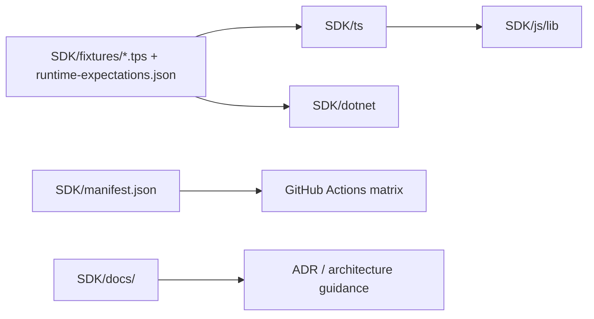
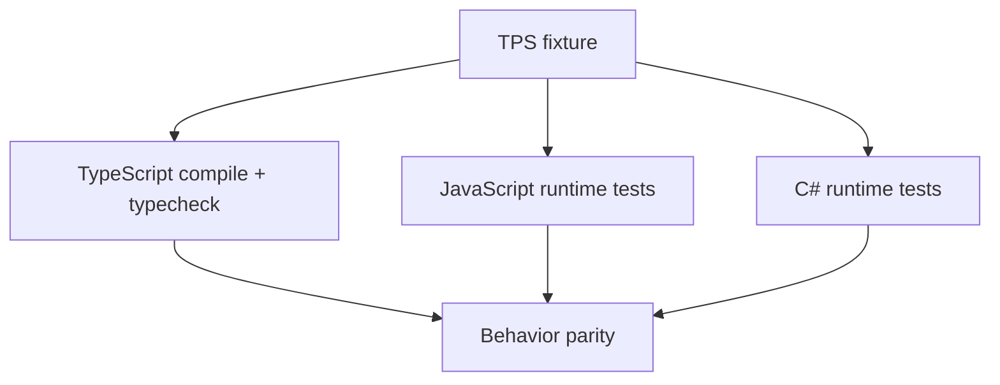

# ManagedCode.Tps SDK Architecture

## Overview

`SDK/` is the canonical home for TPS runtime implementations, shared fixtures, and runtime-specific docs.

## Runtime Contract

Every active runtime must expose:

- spec constants for tags, keywords, metadata keys, and diagnostics
- `validate`
- `parse`
- `compile`
- `player`

Runtime docs live alongside each implementation:

- `SDK/ts/README.md`
- `SDK/js/README.md`
- `SDK/dotnet/README.md`

The compiled output is a JSON-friendly state machine with:

- metadata
- segments
- blocks
- phrases
- words
- per-word timing
- per-word presentation metadata

## Verification Strategy

Shared fixtures in `SDK/fixtures/` drive:

- TS type checks
- JS runtime tests against built output
- C# runtime tests against the same TPS sources
- manifest-driven CI for every enabled runtime

## Extensibility

Future runtimes such as Flutter, Swift, and Java are pre-allocated under `SDK/`.
They remain disabled until:

1. their folder contains a real implementation
2. `SDK/manifest.json` enables them
3. CI commands are added to the manifest entry

## Runtime Matrix

The active runtime set is declared in `SDK/manifest.json`.
`SDK/scripts/runtime-matrix.mjs` turns that manifest into the GitHub Actions matrix, so adding a future runtime is configuration-first rather than a workflow rewrite.
