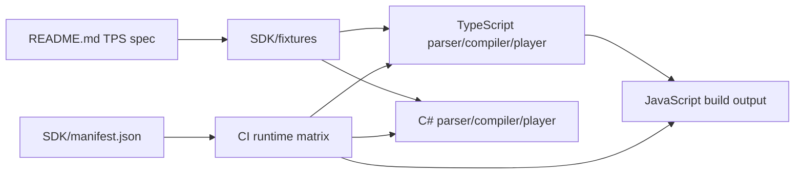

# ADR 0001: SDK Runtime Architecture

## Status

Accepted

## Context

The repository needs a real TPS SDK, not just a format website. The user also requires:

- separate SDK folders per language
- parity between JavaScript, TypeScript, and C#
- extensible CI for future runtimes
- shared validation rules and diagnostics
- a compiled state-machine model and player API

## Decision

We place all runtime work under `SDK/` and treat shared fixtures as the cross-language source of truth.

### Folder layout

- `SDK/ts/`: canonical TS source
- `SDK/js/`: emitted JS runtime, JS-facing tests, and JS-local package metadata
- `SDK/dotnet/`: .NET runtime, solution, and xUnit tests
- `SDK/fixtures/`: shared TPS inputs and expectations
- `SDK/docs/`: SDK architecture and ADRs
- `SDK/manifest.json`: enabled runtimes and CI commands

### Behavioral contract

Each runtime implements:

- constants catalog
- validator with actionable diagnostics
- parser
- compiler to a JSON-friendly state machine
- player that resolves the presentation model at a given time

### CI contract

GitHub Actions reads `SDK/manifest.json` through `SDK/scripts/runtime-matrix.mjs` and runs the enabled runtimes as a matrix.
This keeps runtime activation declarative instead of scattering conditions across workflow YAML.

## Consequences

### Positive

- shared fixtures reduce runtime drift
- TS remains the authoring source while JS tests the emitted artifact
- future runtimes can be added by enabling a manifest entry
- SDK docs stay close to code and tests

### Negative

- runtime parity still requires duplicated implementation work across TS and C#
- coverage enforcement is stricter and needs ongoing maintenance as the SDK grows

## Architecture

## Testing

- TypeScript: compile + public API type checks
- JavaScript: runtime behavior and 100% JS coverage against built output
- C#: xUnit against shared fixtures and example scripts
- Repo quality: site build, .NET format, .NET build, and .NET tests from `SDK/dotnet/ManagedCode.Tps.slnx`

## Follow-up

- enable future runtimes only after they implement the same public contract
- keep shared fixtures authoritative for cross-language parity
- expand C# coverage gates as the runtime matures
