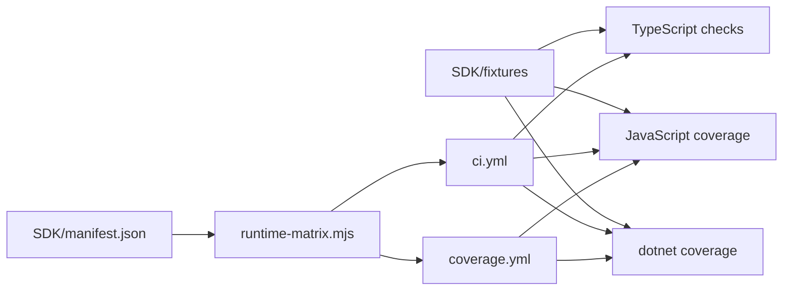

# ADR 0002: Cross-Runtime Verification And CI

## Status

Accepted

## Context

The TPS SDK now spans multiple runtimes and must stay behaviorally aligned across them.
The user also requires:

- green CI on every commit
- minimum 90% coverage for active runtimes
- a path to enable more runtimes later without rewriting the workflow
- durable docs for development and testing under `SDK/`

## Decision

We verify TPS runtimes from manifest-driven matrices and split GitHub automation into separate build/test and coverage pipelines.

### Runtime Verification Rules

- TypeScript verifies the typed public contract.
- JavaScript verifies the built artifact and enforces at least 90% coverage with `c8`.
- C# verifies the .NET runtime and enforces at least 90% line, branch, and method coverage with `coverlet.msbuild`.

### CI Orchestration

- `SDK/manifest.json` is the source of truth for enabled runtimes.
- `SDK/scripts/runtime-matrix.mjs` converts the manifest into the GitHub Actions matrices.
- `.github/workflows/ci.yml` runs build and test checks.
- `.github/workflows/coverage.yml` runs the separate coverage pipeline and enforces the `>= 90%` threshold.
- Disabled future runtimes stay documented but do not participate in CI until implemented.

## Consequences

### Positive

- runtime enablement is declarative
- adding Flutter, Swift, or Java later does not require redesigning CI
- shared fixtures keep behavior parity testable across runtimes
- the C# and JS runtimes have hard coverage gates rather than best-effort reporting

### Negative

- every new branch in an active runtime must be backed by tests immediately
- runtime parity changes must update both shared fixtures and multiple language implementations

## Flow

## Follow-up

- keep future runtimes disabled until they implement the full TPS contract
- keep thresholds at or above 90% for active runtimes unless an ADR explicitly changes that policy
