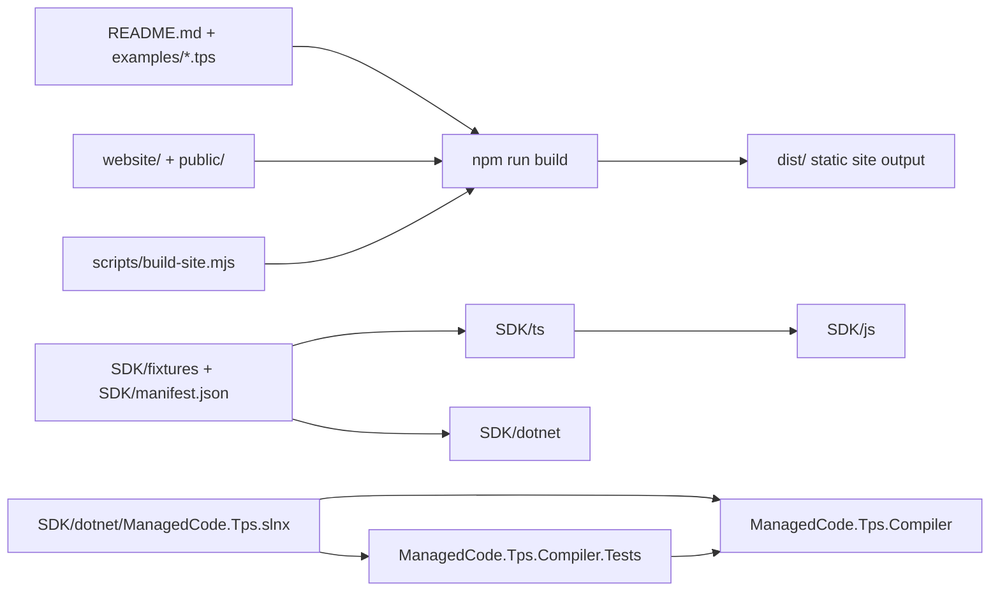
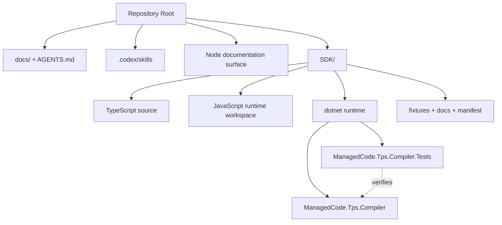

# ManagedCode.Tps Architecture

## Overview

This repository currently has three delivery surfaces:

1. A static TPS documentation site built with Node.js.
2. An SDK workspace under `SDK/` for TypeScript, JavaScript, C#, and future runtimes.
3. A .NET solution rooted at `SDK/dotnet/ManagedCode.Tps.slnx` for the C# SDK projects.

## Repository Boundaries

- The site surface owns documentation publishing and static example rendering.
- `SDK/` owns runtime implementations, shared fixtures, manifest-driven verification metadata, and SDK-focused docs.
- `ManagedCode.Tps.Compiler` is the C# SDK implementation area for TPS parsing, validation, compilation, and playback logic.
- `ManagedCode.Tps.Compiler.Tests` owns xUnit-based verification for the C# runtime.
- `.codex/skills/` holds repo-local MCAF and .NET companion skills used by Codex.

## Verification Flow

- Site changes: run `npm run build`.
- SDK JS/TS changes: run `npm run build:tps`, `npm run test:types`, and `npm run coverage:js`.
- .NET changes: run `dotnet format SDK/dotnet/ManagedCode.Tps.slnx --verify-no-changes`, `dotnet build SDK/dotnet/ManagedCode.Tps.slnx -warnaserror`, and `dotnet test SDK/dotnet/ManagedCode.Tps.slnx`.
- Coverage checks use `dotnet test SDK/dotnet/ManagedCode.Tps.slnx /p:CollectCoverage=true /p:CoverletOutputFormat=json /p:ThresholdType=line%2Cbranch%2Cmethod /p:Threshold=90`.
